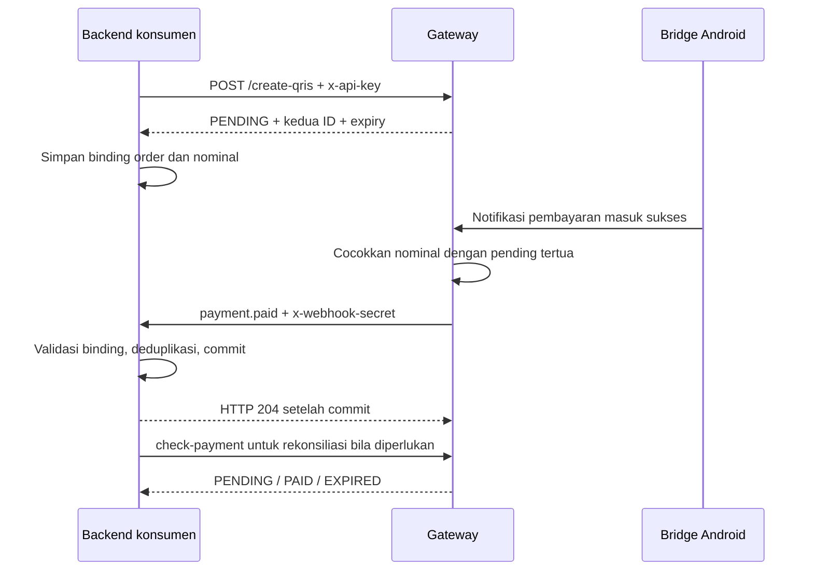

# Integrasi DANA API Gateway

Kontrak ini berdasarkan source lokal yang diaudit pada **6 Oktober 2026**.
Gateway Node.js/Express/SQLite ini mengubah template QRIS dan memproses notifikasi
Android. Status `PAID` berasal dari pencocokan notifikasi, bukan verifikasi
settlement melalui API resmi DANA. Temuan yang memengaruhi integrasi ada di
[audit fungsional](functional-audit-2026-10-06.md).

## Mulai dengan SDK

Instal paket lokal [sdk/javascript](../sdk/javascript/README.md) dari proyek
konsumen:

```sh
npm install /path/ke/dana-api-gateway/sdk/javascript
```

```ts
import { DanaGatewayClient, GatewayError } from 'dana-gateway-sdk';

const gateway = new DanaGatewayClient({
    baseUrl: process.env.DANA_GATEWAY_URL!,
    apiKey: process.env.DANA_GATEWAY_API_KEY!,
});

// Nominal harus dihitung dari order di backend, dalam integer rupiah.
const qr = await gateway.createQris({ amount: 25000, referenceId: 'ORDER-123' });
// Commit binding order -> reference_id, qris_id, trx_id, amount, expires_at.
// Setelah commit, kirim qris_url ke pelanggan untuk membuka halaman kasir.
const payment = await gateway.checkPayment(qr.trx_id);
if (payment.status === 'PAID' && payment.amount === qr.amount) {
    // Terapkan transisi dan fulfillment satu kali dalam storage konsumen.
}
```

Kode di atas menunjukkan pemanggilan SDK; komentar commit/fulfillment harus
diganti dengan transaksi database aplikasi Anda. Lihat
[contoh Node](../examples/node-client.mjs), [PHP](../examples/php-client.php), dan
[Python](../examples/python-client.py). Ketiganya membuat transaksi ketika
dijalankan; gunakan environment target yang memang diizinkan. Audit hanya
menjalankannya dengan fixture loopback.

Paket menggunakan ESM dan menyertakan `index.d.ts`; tidak memerlukan bundler atau
dependency runtime. Untuk distribusi internal jalankan `npm pack` di folder SDK
dan instal `.tgz` hasilnya. Paket belum dipublikasikan ke registry npm.

## Urutan transaksi



Jika tidak ada notifikasi yang cocok sebelum expiry lima menit, pending menjadi
`EXPIRED` saat sweep/pembacaan. Timer background berjalan tiap 60 detik.
Transaksi expired tidak bisa dibayar lewat matching normal, sehingga notifikasi
Android yang datang terlambat dapat berakhir unmatched.

## Autentikasi dan endpoint

Base URL berupa origin gateway atau prefix reverse proxy, misalnya
`https://gateway.example.invalid`. Gunakan HTTPS pada integrasi eksternal.
API key dikirim lewat header **`x-api-key`**. Jangan menaruhnya di frontend atau
query URL. Secret callback terpisah dan dikirim sebagai **`x-webhook-secret`**.

| Endpoint yang dianjurkan | Auth | Hasil HTTP 200 |
| --- | --- | --- |
| `GET /health`, `/api/health` | Publik | `{status:'OK',service,timestamp}`, tanpa `success` |
| `POST /create-qris` | API key | `{success:true,data:{...}}` |
| `GET /check-payment?trx_id=...` atau `?qris_id=...` | API key | `{success:true,data:{...}}` |
| `GET /api/qr-status/:id` | Publik | `{success:true,qris_id,trx_id,amount,status,paid,paid_at,expires_at}` |
| `GET /api/qr/:id` | Publik | `{success:true,data:{...,qris_code,expires_at}}` |
| `GET /qr/:id` | Publik | HTML kasir |
| `GET /qr/:id?format=raw` | Publik | Redirect 302 ke QRServer; expired 410 |
| `POST /api/notifications`, `/webhook/dana` | API key | `{success:true,matched,data,message}` |

Lookup menerima `qris_id` atau `trx_id`. `check-payment` menerima juga body,
tetapi query ID pada GET adalah profil yang dipakai SDK. Source `app.all`
menerima metode lain pada create/check/notifikasi; integrasi baru menggunakan
metode di tabel. Tidak tersedia lookup unik berdasarkan `reference_id`, cancel,
refund, daftar transaksi merchant, atau replay callback melalui API ini.

**GET memiliki efek samping:** lookup dapat menulis status expired; status,
check-payment dan kasir dapat menjalankan pengiriman callback expiry, termasuk
transaksi lain dalam backlog. Detail `/api/qr/:id` memperbarui expiry tanpa
langsung memanggil dispatcher. Jangan menggunakan lookup sebagai probe produksi
yang diasumsikan read-only.

Kontrak lengkap yang dapat diimpor ke alat API:
[OpenAPI 3.1.1](openapi.json). Schema nominal memakai profil integrasi integer
positif safe; source backend masih menerima sebagian input coercive.

## Create dan status

Request JSON:

```json
{"amount":25000,"reference_id":"ORDER-123"}
```

`qris_static` opsional jika template sudah diatur lewat `QRIS_STATIC` gateway.
`reference_id` opsional, tetapi wajib Anda isi bila membutuhkan callback.
Source melakukan trim dan tidak memberlakukan keunikan reference. Amount adalah
rupiah integer positif; jangan kirim pecahan, string berformat mata uang,
scientific notation, nilai negatif, atau nilai di luar safe integer JavaScript.

Response fixture create:

```json
{
  "success": true,
  "data": {
    "qris_id": "fixture1",
    "trx_id": "TRX-FIXTURE1",
    "reference_id": "ORDER-123",
    "qris_url": "https://gateway.example.invalid/qr/fixture1",
    "qris_code": "STRING_QRIS_HASIL_GATEWAY",
    "amount": 25000,
    "status": "PENDING",
    "expires_at": "2026-10-06T03:05:00.000Z",
    "expires_in": "5 menit"
  }
}
```

Nilai `qris_code` di contoh hanya placeholder, bukan template yang dapat
dipindai. Gunakan QRIS merchant yang sudah diverifikasi secara terpisah.
Halaman kasir dan raw image bergantung pada `api.qrserver.com`; aplikasi konsumen
dapat merender `qris_code` melalui library QR lokalnya sendiri.

Status publik bersifat flat; check-payment memakai `data` dan tidak memiliki
`expires_at`. SDK menyamakan hasilnya menjadi objek transaksi. `PENDING` berarti
belum cocok, `PAID` cocok dengan notifikasi, `EXPIRED` sudah lewat batas waktu.
`paid_at` dapat null. ID tidak ditemukan menghasilkan HTTP 404, bukan EXPIRED.

## Bridge notifikasi Android

Gunakan salah satu format:

```http
POST /api/notifications
Content-Type: application/json
x-api-key: <secret gateway>

{"amount":25000,"text":"Fixture menerima Rp 25.000"}
```

Atau `application/x-www-form-urlencoded` dengan field `text` bila aplikasi
Android sulit melakukan JSON escaping. `text/plain` tidak didukung oleh
middleware HTTP saat ini. Field teks harus string. Jangan kirim objek/array
sebagai teks; audit menemukan input ini dapat mematikan proses sesudah PAID.

Bridge harus memfilter sumber aplikasi, tipe pembayaran **masuk**, dan hasil
**sukses**. Gateway tidak memahami makna pesan gagal, transfer keluar, atau OTP.
Nominal terstruktur positif integer lebih jelas daripada parser teks; parser
saat ini bisa menafsirkan `Rp 15.000,00` sebagai 1500000. SDK memvalidasi amount
terstruktur tetapi tidak membuktikan makna `text`.

`matched:false` tetap HTTP 200 dan `success:true`: notifikasi tersimpan tanpa
transaksi cocok. `matched:true` menghasilkan data PAID beserta hasil callback.
Pengiriman ulang notifikasi dapat membayar pending berikutnya dengan nominal
sama. Gateway belum menyediakan notification ID atau deduplikasi.

## Callback konsumen

Di gateway atur `PAYMENT_WEBHOOK_URL` dan `PAYMENT_WEBHOOK_SECRET` melalui
konfigurasi deployment Anda. Pengiriman hanya dilakukan bila reference, URL,
dan secret tersedia. Callback tidak menggunakan API key inbound.

Field bersama: `reference_id`, `qris_id`, `trx_id`, `amount`, `event`, `status`.

| Event | Status callback | Field tambahan |
| --- | --- | --- |
| `payment.paid` | `paid` | `paid_at`, `payment_details` |
| `payment.expired` | `expired` | `expired_at` |

Status callback huruf kecil, berbeda dari status API. `payment_details` dapat
objek, string, atau null; jangan menjadikannya skema identitas pembayar.

Pakai `parsePaymentCallback(request, secret)` untuk Web Request. Helper
memeriksa secret dan struktur payload, lalu mengembalikan union TypeScript.
Contoh handler dengan adaptor storage ada di [README SDK](../sdk/javascript/README.md#callback).
Di PHP verifikasi secret dengan `hash_equals($expected, $received)`; di Python
gunakan `hmac.compare_digest(expected, received)`, lalu validasi JSON dan binding.
Secret header ini bukan HMAC payload; tidak ada signature, event ID atau jaminan
perlindungan replay.

Kontrak operasi penyimpanan `applyPayment(event)`:

1. Cari order dari namespace gateway + reference; cocokkan **kedua ID** dan
   amount dengan binding tersimpan. Reference saja tidak cukup.
2. Gunakan transaksi database persisten dan unique constraint pada
   `(gateway_id,trx_id,event)` agar request ulang/race tidak memproses event dua kali.
3. Terapkan transisi status yang valid. PAID tidak boleh mundur menjadi EXPIRED.
   Jika event konflik dengan status terminal, lakukan rekonsiliasi gateway dan
   tinjauan aplikasi; jangan menebak berdasarkan urutan kedatangan event.
4. Commit perubahan order dan marker event atomik. Untuk fulfillment terpisah,
   simpan job/outbox bersama commit dan gunakan kunci order yang unik.
5. Balas 2xx sesudah commit. Error storage atau binding yang belum siap harus
   menghasilkan 5xx dan ditangani rekonsiliasi; jangan mengakui pekerjaan yang
   belum disimpan.

Kebijakan pengiriman gateway:

| Hasil | `data.callback.status` | Attempt |
| --- | --- | --- |
| HTTP 2xx | `delivered` | Sampai berhasil, maksimal 3 |
| HTTP 400/404/422 | `rejected` | Langsung berhenti |
| HTTP lain, network error, timeout | `failed` jika habis | Maksimal 3 |
| Reference kosong | `skipped` | 0 |
| URL/secret kosong | `not_configured` | 0 |

Timeout setiap attempt 5 detik, jeda retry 100 ms. `PAID` lokal tetap PAID saat
callback gagal. Callback PAID tidak mempunyai antrean durable. Callback expired
juga ditandai selesai saat rejected/failed, sehingga `expiry_webhook_sent=1`
tidak membuktikan delivery 2xx. `not_configured` untuk expiry masih dapat dicoba
lagi setelah konfigurasi tersedia. Race dispatcher expiry dapat menggandakan
event. Konsumen tetap memerlukan deduplikasi persisten dan rekonsiliasi.

## Rekonsiliasi dan timeout

Simpan kedua ID sebelum checkout. Job backend konsumen dapat mengecek
`checkPayment(trxId)` untuk order yang belum selesai, khususnya setelah deadline
dan sesudah kegagalan callback. Terapkan validasi binding/amount serta perubahan
idempoten yang sama seperti callback. Jadwal dan batas waktu operasional mengikuti
aplikasi Anda; gateway tidak menjamin notifikasi Android tiba tepat waktu.

UI frontend boleh polling status publik tanpa key. Keputusan fulfillment harus
berasal dari backend. Gunakan status server untuk menentukan terminal; countdown
klien bukan bukti expiry. Audit menemukan kasir bawaan menghentikan polling pada
deadline lokal, sehingga PAID menjelang expiry dapat memerlukan reload.

SDK tidak retry otomatis. Timeout/koneksi putus pada **create** dapat terjadi
setelah transaksi tersimpan, dan reference belum unik. Jika ID respons hilang,
belum ada endpoint untuk menghilangkan ambiguitas tersebut secara otomatis.
Jangan otomatis membuat QR kedua atau mengirim ulang notifikasi pembayaran.
HTTP status untuk `HTTP_ERROR` tersedia melalui `GatewayError.status`; body server sengaja
tidak disertakan dalam error SDK karena bisa memuat input sensitif.

## Platform lain

Untuk Laravel, gunakan [contoh PHP](../examples/php-client.php) atau HTTP client
framework di service backend dengan `x-api-key`, JSON, timeout 20 detik, dan
tanpa retry otomatis pada create/notifikasi. Binding order dan handler callback
harus memakai transaksi database dan constraint unik milik aplikasi.

Untuk Python, [contoh standard library](../examples/python-client.py) tidak
memerlukan dependency. Untuk Django/FastAPI/Flask, gunakan lapisan database
framework untuk commit callback, bukan dictionary/set dalam memory proses.

Untuk Cloudflare Workers, gunakan paket ESM yang sama di dalam handler yang
sudah ada; buat client per request dan baca konfigurasi dari `env`:

```js
const gateway = new DanaGatewayClient({
    baseUrl: env.DANA_GATEWAY_URL,
    apiKey: env.DANA_GATEWAY_API_KEY,
    fetch,
});
const payment = await gateway.checkPayment(storedTrxId);
```

Helper callback menerima Request Worker secara langsung. Tunggu commit storage
sebelum Response 204. Contoh ini tidak membuat storage, route publik checkout,
atau deployment Worker. Tes SDK dijalankan pada Node; native Workers dan konsumen
produksi belum diuji. API fetch dan Web Crypto mengacu pada
[fetch Workers](https://developers.cloudflare.com/workers/runtime-apis/fetch/),
[Web Crypto Workers](https://developers.cloudflare.com/workers/runtime-apis/web-crypto/)
dan [praktik Workers](https://developers.cloudflare.com/workers/best-practices/workers-best-practices/).

## Verifikasi lokal

```sh
npm run verify
npm run test:sdk
npm run audit:functional
git diff --check
```

`verify` dan tes SDK memeriksa alur yang diharapkan dengan SQLite/secret fixture
dan HTTP loopback. Script audit menghasilkan `OBSERVED` saat cacat saat ini
berhasil direproduksi; exit 0 script audit **tidak berarti temuan sudah diperbaiki**.
Audit tidak memindai QR merchant, menggunakan Android nyata, membangun container,
atau menyatakan produksi berhasil. Detail bukti ada di [laporan audit](functional-audit-2026-10-06.md).

Referensi format/tooling: [OpenAPI 3.1.1](https://spec.openapis.org/oas/v3.1.1.html)
dan [fetch Node.js](https://nodejs.org/api/globals.html#fetch).
